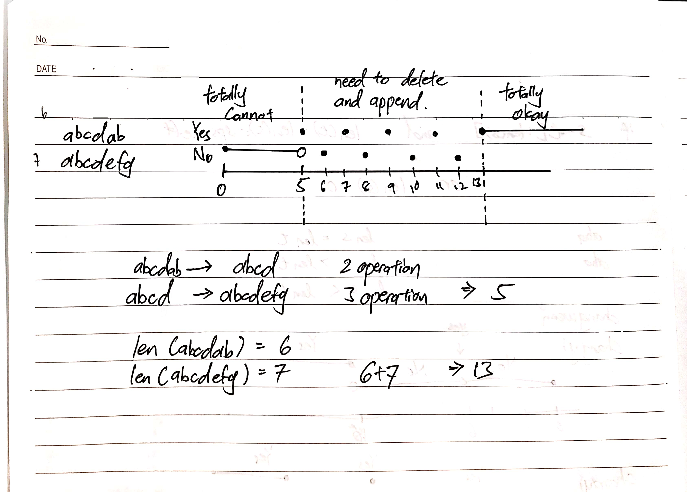

# [Append and Delete](https://www.hackerrank.com/challenges/append-and-delete/problem)

## Answer
```python
def appendAndDelete(s, t, k):
    answer = False
    for i in reversed(range(len(s)+1)):
        if (s[:i]==t[:i]):
            break
    
    if k >= (len(s) + len(t)):
        answer = True
    elif k < ((len(s)-i + len(t)-i)):
        answer = False
    elif (k - (len(s)-i + len(t)-i))%2==0:
        answer = True
    
    if answer:
        return "Yes"
    else:
        return "No"
```

## Explain 


According to the characteristics the answer can be divided into three parts
|part|explain|
|:-:|:--|
|totally cannot|the operation time is not enough to make `s` become `t`|
|need to delete and append|in this stage still can futher divide into two type, excatly `s` become `t` and carry out extra delete and append|
|totally okay|since the question provided that delete the empty string still become the empty string, as long as the `k` is higher or equal to the total length of `s` and `t`, the answer will be yes